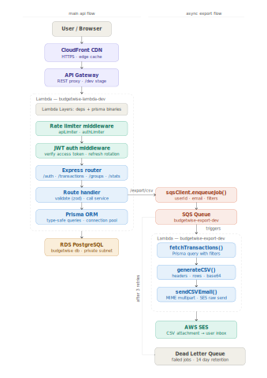
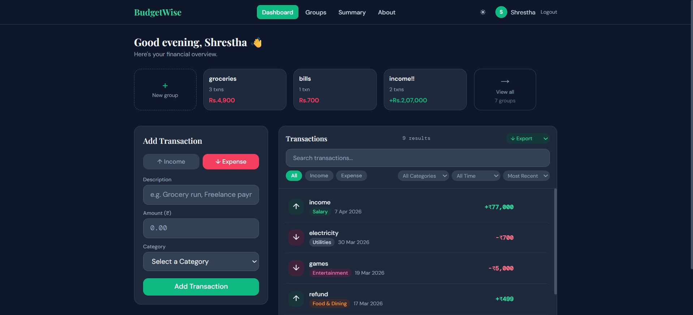
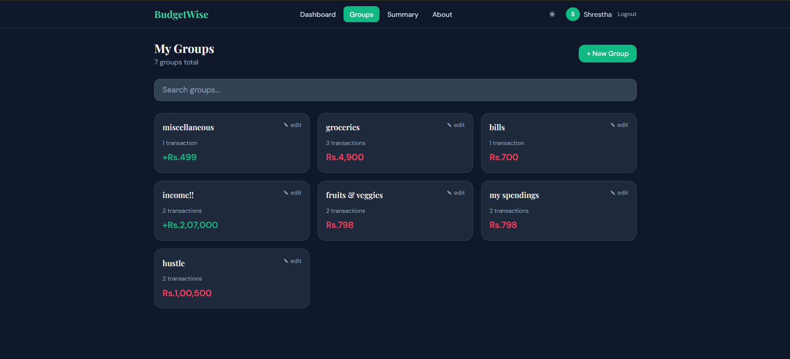
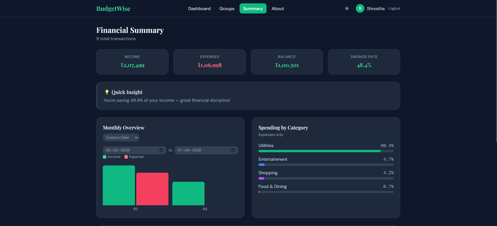

# BudgetWise

A personal finance manager built with a fully serverless AWS backend. Track transactions, manage group budgets, export reports via email, and monitor spending patterns — all behind a single CloudFront URL.

---

## Background

Built to explore the gap between knowing individual technologies and making them work together under real constraints like async queues instead of blocking exports, short-lived tokens with httpOnly cookie rotation instead of persistent localStorage JWTs, infrastructure-as-code instead of clicking through consoles. Every architectural decision has been enhanced with a reason behind it.

---

## Architecture



The backend is split into two Lambda functions. The main one handles all API routes through Express + `serverless-http`. The export Lambda is decoupled entirely, it's triggered by SQS when a user requests a CSV export, generates the file, and emails it via SES. If it fails, SQS retries up to 3 times before moving the message to a dead-letter queue.

The entire infrastructure is defined in `infrastructure.yml` (CloudFormation) and can be recreated with a single command.





---

## Stack

**Frontend** — React, Redux Toolkit (RTK Query), Tailwind CSS, Vite  
**Backend** — Node.js, Express.js, Prisma ORM, JWT (access + refresh tokens)  
**Database** — PostgreSQL on AWS RDS  
**Infrastructure** — AWS Lambda, API Gateway, S3, CloudFront, SQS, SES, CloudWatch, IAM  
**IaC & CI/CD** — AWS CloudFormation, GitHub Actions

---

## Features

**Transactions** — add, edit, delete, and filter income/expense entries with type and category breakdowns.

**Group Budgets** — create named groups, add transactions to them, track shared spending separately from personal finances.

**CSV Export** — async export pipeline. The request is queued in SQS, processed by a separate Lambda, and delivered to your inbox as a CSV attachment without blocking the main API.

**Stats** — spending summaries, category breakdowns, and balance trends computed server-side.

**Auth** — JWT with refresh token rotation. Access tokens are short-lived; refresh tokens are stored in HTTP-only cookies and rotated on every use.

---

## Running Locally

```bash
# Backend
cd backend
cp .env.example .env   # fill in DATABASE_URL, JWT_SECRET, etc.
npm install
npx prisma migrate dev
npm run dev            # runs on :5000

# Frontend
cd frontend
npm install
npm run dev            # runs on :5173
```

The frontend proxies `/api/*` to `:5000` in dev mode via Vite config, so no CORS setup is needed locally.

---

## Deployment

Infrastructure is managed through CloudFormation. A single deploy command provisions Lambda, API Gateway, SQS queues, IAM roles, and CloudFront:

```bash
aws cloudformation deploy \
  --template-file infrastructure.yml \
  --stack-name budgetwise-dev \
  --parameter-overrides Environment=dev FrontendURL=<url> JwtSecret=<secret> ... \
  --capabilities CAPABILITY_NAMED_IAM
```

CI/CD runs on GitHub Actions. Pushing to `main` and triggering `workflow_dispatch` runs tests, deploys the frontend to S3, updates the Lambda function code, and syncs the CloudFormation stack, in that order.

Lambda dependencies (Prisma, node_modules) are split across two Lambda Layers to stay within the 250MB uncompressed limit. The function code zip itself is ~50KB.

---

## Project Structure

```
├── backend/
│   ├── routes/          # auth, transactions, groups, stats, export, ...
│   ├── middleware/       # JWT auth, rate limiting, error handler
│   ├── workers/         # legacy SQS polling worker (local dev only)
│   ├── utils/           # logger (CloudWatch), SQS client
│   ├── prisma/          # schema, migrations, seed
│   ├── lambda.js        # Lambda entry point (wraps Express via serverless-http)
│   └── exportLambda.js  # SQS-triggered export handler
├── frontend/
│   └── src/
│       ├── store/       # RTK Query API slice + auth slice
│       ├── pages/       # Dashboard, Login, Summary, Groups, Export
│       └── components/
├── infrastructure.yml   # CloudFormation template (full infra)
└── .github/workflows/
    └── deploy.yml       # CI/CD pipeline
```

---

## Environment Variables

| Variable | Description |
|---|---|
| `DATABASE_URL` | PostgreSQL connection string |
| `JWT_SECRET` | Access token signing key |
| `JWT_REFRESH_SECRET` | Refresh token signing key |
| `FRONTEND_URL` | Allowed CORS origin |
| `SQS_QUEUE_URL` | Export queue URL |
| `SES_FROM_EMAIL` | Verified sender email (AWS SES) |
| `NODE_ENV` | `development` / `production` |

---

Built by [Shrestha Jaiswal](https://github.com/ShresthaJaiswal)
